# Skyfer ☁️

**Skyfer** is a modern cloud storage web application that allows users to securely upload, manage, and access their files from anywhere. The platform is designed to provide a clean user experience similar to popular storage services while being lightweight and developer‑friendly.

Skyfer is built using the **MERN stack** and deployed using modern cloud platforms, making it scalable and efficient for real‑world usage.

---

# 📸 Screenshots

## Hero Page

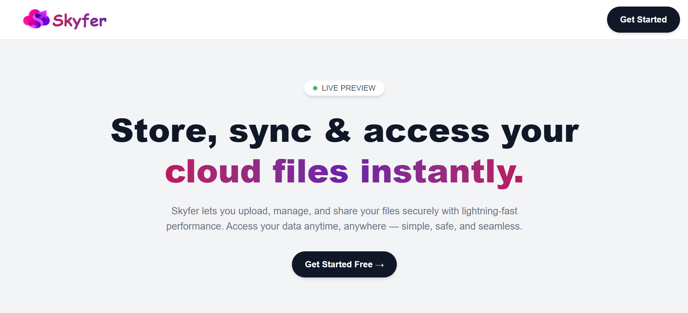

## Hero Sub

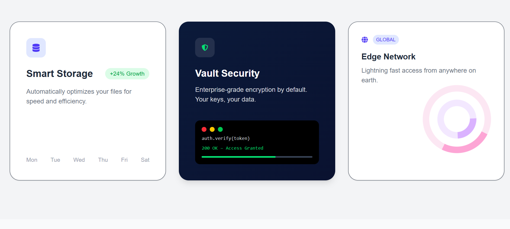

## Why skyfer

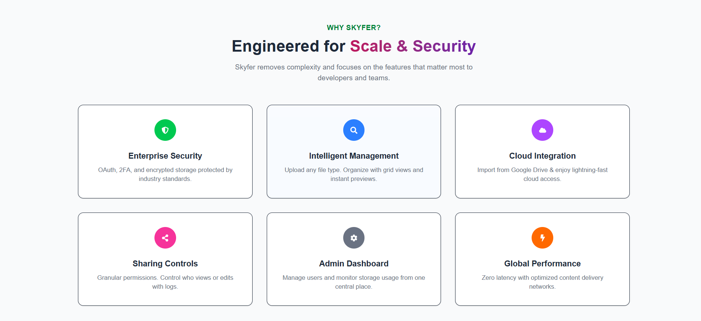

## How skyfer works

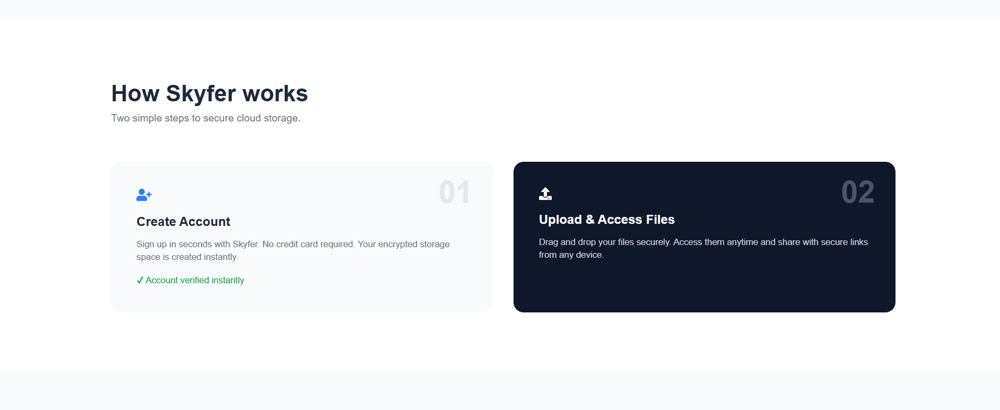

## Contact us

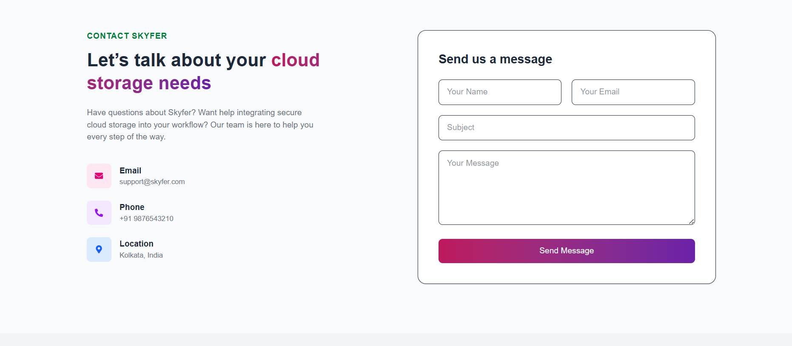

## Testimonial

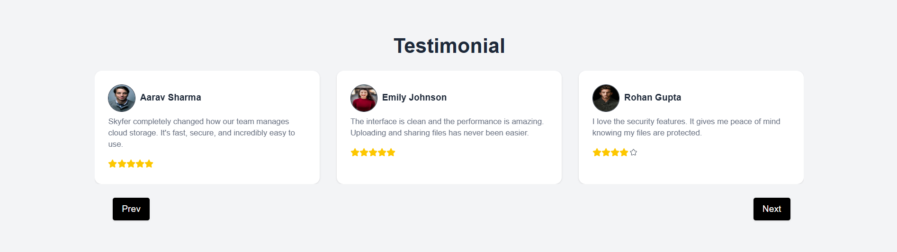

## Footer

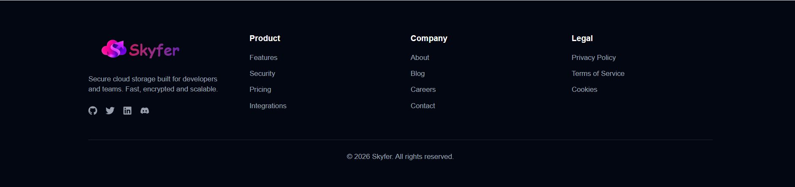

## Register

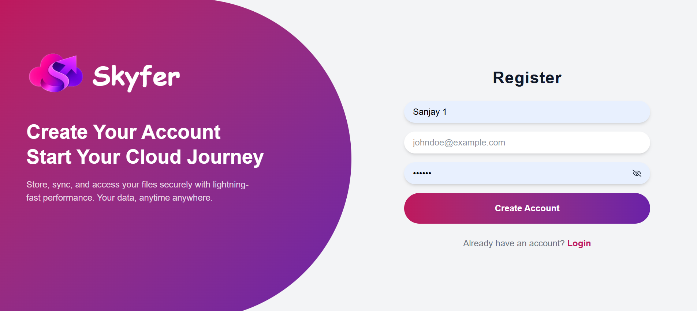

## Login

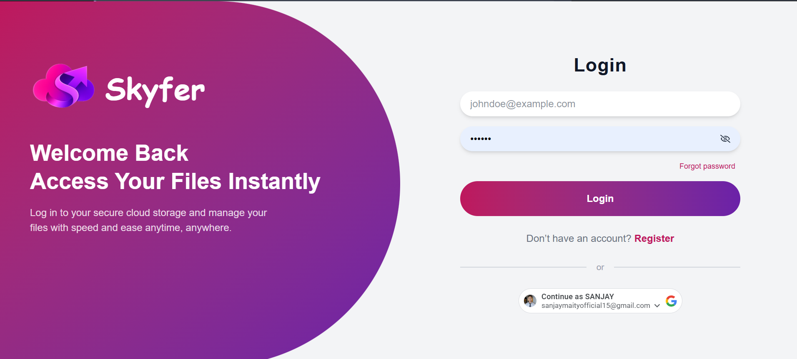

## User dashboard

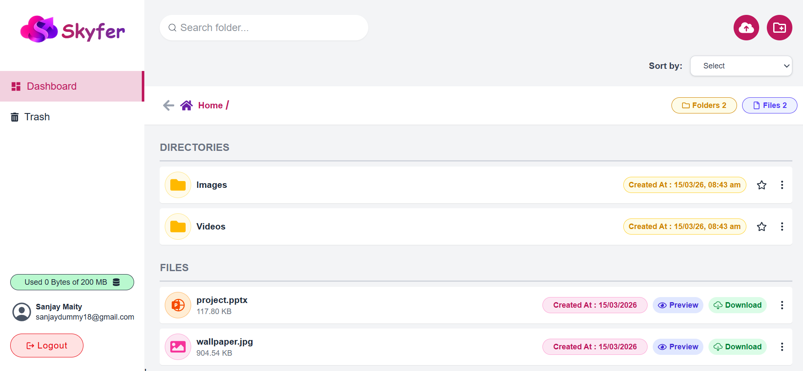

## Trash

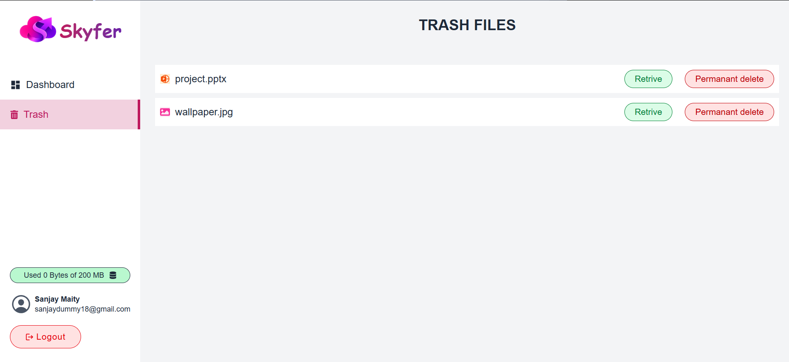

## Profile

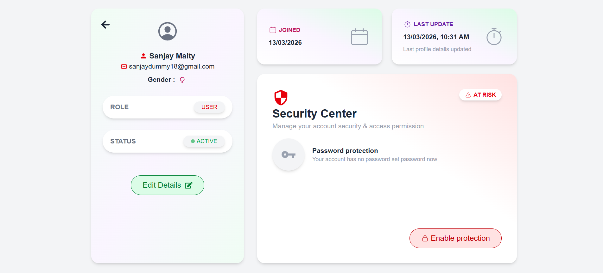

## Admin

## 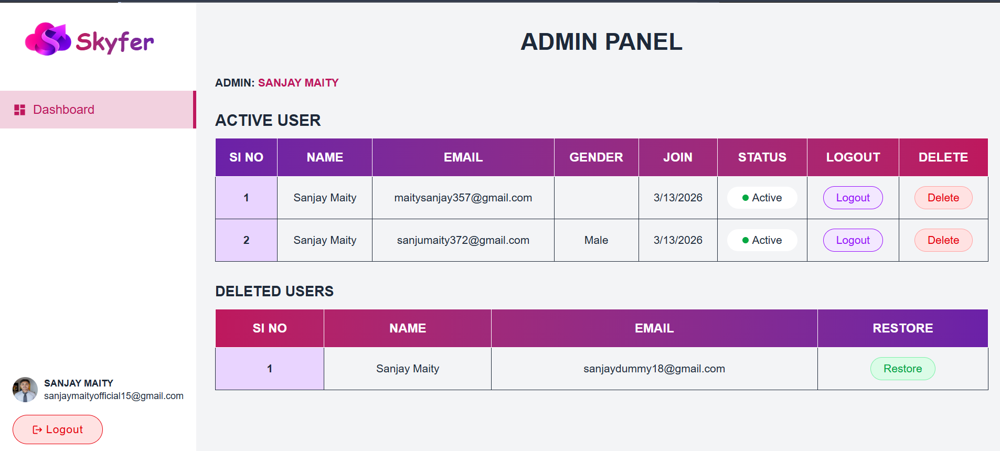

# 🚀 Features

## Authentication System

- User Registration
- Secure Login & Logout
- Email verification with OTP
- Protected routes
- Persistent login sessions

## User Profile

- Edit username and personal information
- Upload or update profile picture
- View account information

## File Management

- Upload files to cloud storage
- View uploaded files in dashboard
- Download stored files
- Delete files from storage

## Dashboard

- Clean and responsive dashboard UI
- Displays uploaded files
- Easy file actions (download/delete)

## Storage System

- Cloud based file storage
- Secure file handling through backend

## Responsive Design

- Works on desktop, tablet, and mobile devices

---

# 🛠 Tech Stack

## Frontend

- React.js
- Redux (State Management)
- React Router
- CSS / Tailwind (if used)

## Backend

- Node.js
- Express.js

## Database

- MongoDB

## File Storage

- Cloudinary / AWS S3 (depending on configuration)

## Deployment

- Frontend: Vercel
- Backend: Render

---

# 📁 Project Structure

```
Skyfer
│
├── client
│   ├── src
│   │   ├── components
│   │   ├── pages
│   │   ├── redux
│   │   ├── utils
│   │   └── App.jsx
│   │
│   └── package.json
│
├── server
│   ├── controllers
│   ├── routes
│   ├── middleware
│   ├── models
│   ├── config
│   └── server.js
│
└── README.md
```

---

# ⚙️ Installation

## 1 Clone Repository

```
git clone https://github.com/yourusername/skyfer.git
```

## 2 Go to Project Folder

```
cd skyfer
```

## 3 Install Dependencies

### Frontend

```
cd client
npm install
```

### Backend

```
cd server
npm install
```

---

# 🔑 Environment Variables

Create a `.env` file in the **server** directory and add the following:

```
PORT=5000
MONGO_URI=your_mongodb_connection
JWT_SECRET=your_secret_key
CLOUDINARY_CLOUD_NAME=your_cloud_name
CLOUDINARY_API_KEY=your_api_key
CLOUDINARY_API_SECRET=your_api_secret
EMAIL_USER=your_email
EMAIL_PASS=your_email_password
```

---

# ▶️ Running the Project

## Run Backend

```
cd server
npm run dev
```

## Run Frontend

```
cd client
npm run dev
```

Now open:

```
http://localhost:5173
```

---

# 🌐 Deployment

Skyfer is deployed using modern hosting platforms:

Frontend → Vercel
Backend → Render

Steps:

1. Push code to GitHub
2. Connect repository to Vercel
3. Deploy backend on Render
4. Configure environment variables

---

# 🔒 Security

Skyfer implements several security practices:

- JWT authentication
- Password hashing
- Protected API routes
- Secure file upload handling

---

# 📌 Future Improvements

Planned features:

- Folder support
- File sharing with public links
- Drag & drop upload
- Storage usage analytics
- File preview (images, pdf, videos)
- Search functionality

---

# 👨‍💻 Author

**Sanjay Maity**

Aspiring Full Stack Developer focused on building scalable web applications using the MERN stack.

---

# ⭐ Support

If you like this project, consider giving it a **star on GitHub**. It helps others discover the project and motivates further development.
